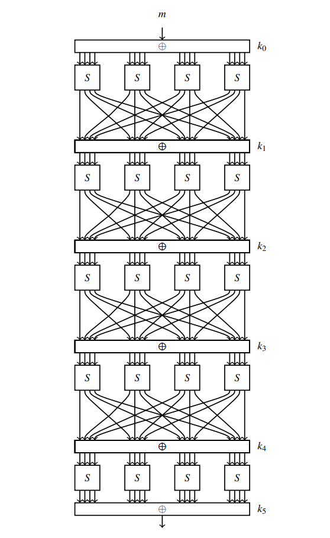
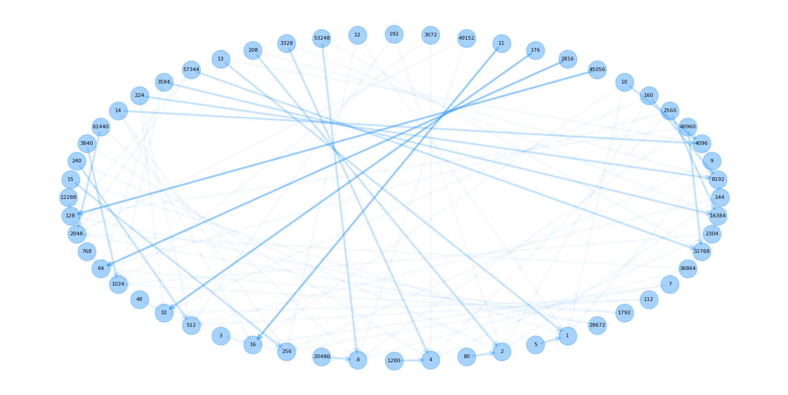

# Differential-Cryptanalysis-of-SPN
A respository of Differential Cryptanalysis. Mainly focusing on SPN structure, lower bound of active Sbox, differential characteristic. 

## Info about the repository

The repository mainly analyzed the differential characteristic of a simple SPN structure cipher and we proposed a new directed-graph-based algorithm to obtain the lower bound of the number of active Sbox for any round. The default parameter of CipherN is (These two parameters are well-designed. You can choose random parameters.):

Sbox ：

| *x*    | 0    | 1    | 2    | 3    | 4    | 5    | 6    | 7    | 8    | 9    | A    | B    | C    | D    | E    | F    |
| ------ | ---- | ---- | ---- | ---- | ---- | ---- | ---- | ---- | ---- | ---- | ---- | ---- | ---- | ---- | ---- | ---- |
| S(*x*) | E    | 4    | D    | 1    | 2    | F    | B    | 8    | 3    | A    | 6    | C    | 5    | 9    | 0    | 7    |


Permutation

| *s*    | 1    | 2    | 3    | 4    | 5    | 6    | 7    | 8    | 9    | 10   | 11   | 12   | 13   | 14   | 15   | 16   |
| ------ | ---- | ---- | ---- | ---- | ---- | ---- | ---- | ---- | ---- | ---- | ---- | ---- | ---- | ---- | ---- | ---- |
| P(*s*) | 1    | 5    | 9    | 13   | 2    | 6    | 10   | 14   | 3    | 7    | 11   | 15   | 4    | 8    | 12   | 16   |


The structure of our analyzed cipher is :




For more detailed manual analysis, see : `The block cipher companion. In Information Security and Cryptography, 2011` . The cipher and parameters are from the chapter 6. 


## Usage

A brief introduction to the four source code file:

- `CipherN.py`: A simple implementation of CipherN with SPN structure. (modified from [repo](https://github.com/physics-sec/Differential-Cryptanalysis/blob/master/basic_SPN.py))
- `differential_analysis.py`: Auto differential analysis of CipherN.  It can find differential path with the highest probability and also the path with least number of active Sbox (probably). 
- `SBox.py`:  Single Sbox analysis. Similar to the `sage.crypto.Sbox` library. You can use this class implementation to analyze any Sbox.
- `active_sbox_analysis.py`: Use the `networkx` of python to set up a directed graph to analyze the lower bound of the number of active Sbox in CipherN. 


## Results

Here we give some results for reference.

- The best differential characteristic ( $prob \ge 2^{-16} $ ) with longest round. 

  ``` python
  [+] Top 10/403 differential_characteristic (dc) of round 6 sorted by dc_prob
  ******************************** Top 1 ********************************
  dc = ([0, 0, 0, 11], [0, 0, 1, 0], [2, 0, 2, 0], [0, 10, 0, 10], [5, 0, 0, 0], [0, 0, 0, 8], [0, 0, 0, 11])
  dc = [11, 16, 8224, 2570, 20480, 8, 11]
  dc_probablity = 0.0001544952392578125
  active_sbox_num = 8
  ******************************** Top 2 ********************************
  dc = ([0, 0, 0, 11], [0, 0, 1, 0], [2, 0, 2, 0], [0, 10, 0, 10], [5, 0, 0, 0], [0, 0, 0, 8], [0, 0, 0, 13])
  dc = [11, 16, 8224, 2570, 20480, 8, 13]
  dc_probablity = 0.0001544952392578125
  active_sbox_num = 8
  ******************************** Top 3 ********************************
  dc = ([0, 11, 0, 0], [0, 0, 4, 0], [2, 0, 2, 2], [0, 11, 0, 11], [0, 0, 5, 0], [0, 0, 0, 2], [0, 0, 0, 5])
  dc = [2816, 64, 8226, 2827, 80, 2, 5]
  dc_probablity = 0.0001544952392578125
  active_sbox_num = 9
  ******************************** Top 4 ********************************
  dc = ([11, 0, 0, 0], [0, 0, 8, 0], [2, 0, 2, 2], [0, 11, 0, 11], [0, 0, 5, 0], [0, 0, 0, 2], [0, 0, 0, 5])
  dc = [45056, 128, 8226, 2827, 80, 2, 5]
  dc_probablity = 0.0001544952392578125
  active_sbox_num = 9
  ```

- The directed graph with one-active sbox differential nodes: 

  ``` python
  start_node = 4096 ,end_nodes_list = []
  start_node = 256 ,end_nodes_list = []
  start_node = 16 ,end_nodes_list = []
  start_node = 1 ,end_nodes_list = []
  start_node = 8192 ,end_nodes_list = []
  start_node = 512 ,end_nodes_list = []
  start_node = 32 ,end_nodes_list = []
  start_node = 2 ,end_nodes_list = []
  start_node = 12288 ,end_nodes_list = [128, 2048]
  start_node = 768 ,end_nodes_list = [64, 1024]
  start_node = 48 ,end_nodes_list = [32, 512]
  start_node = 3 ,end_nodes_list = [16, 256]
  start_node = 16384 ,end_nodes_list = []
  start_node = 1024 ,end_nodes_list = []
  start_node = 64 ,end_nodes_list = []
  start_node = 4 ,end_nodes_list = []
  start_node = 20480 ,end_nodes_list = [8]
  start_node = 1280 ,end_nodes_list = [4]
  start_node = 80 ,end_nodes_list = [2]
  start_node = 5 ,end_nodes_list = [1]
  start_node = 24576 ,end_nodes_list = []
  start_node = 1536 ,end_nodes_list = []
  start_node = 96 ,end_nodes_list = []
  start_node = 6 ,end_nodes_list = []
  start_node = 28672 ,end_nodes_list = [128, 2048]
  start_node = 1792 ,end_nodes_list = [64, 1024]
  start_node = 112 ,end_nodes_list = [32, 512]
  start_node = 7 ,end_nodes_list = [16, 256]
  start_node = 32768 ,end_nodes_list = []
  start_node = 2048 ,end_nodes_list = []
  start_node = 128 ,end_nodes_list = []
  start_node = 8 ,end_nodes_list = []
  start_node = 36864 ,end_nodes_list = [8, 2048, 32768]
  start_node = 2304 ,end_nodes_list = [4, 1024, 16384]
  start_node = 144 ,end_nodes_list = [2, 512, 8192]
  start_node = 9 ,end_nodes_list = [1, 256, 4096]
  start_node = 40960 ,end_nodes_list = [8, 128, 32768]
  start_node = 2560 ,end_nodes_list = [4, 64, 16384]
  start_node = 160 ,end_nodes_list = [2, 32, 8192]
  start_node = 10 ,end_nodes_list = [1, 16, 4096]
  start_node = 45056 ,end_nodes_list = [128]
  start_node = 2816 ,end_nodes_list = [64]
  start_node = 176 ,end_nodes_list = [32]
  start_node = 11 ,end_nodes_list = [16]
  start_node = 49152 ,end_nodes_list = [8, 2048]
  start_node = 3072 ,end_nodes_list = [4, 1024]
  start_node = 192 ,end_nodes_list = [2, 512]
  start_node = 12 ,end_nodes_list = [1, 256]
  start_node = 53248 ,end_nodes_list = [8, 32768]
  start_node = 3328 ,end_nodes_list = [4, 16384]
  start_node = 208 ,end_nodes_list = [2, 8192]
  start_node = 13 ,end_nodes_list = [1, 4096]
  start_node = 57344 ,end_nodes_list = [128, 2048, 32768]
  start_node = 3584 ,end_nodes_list = [64, 1024, 16384]
  start_node = 224 ,end_nodes_list = [32, 512, 8192]
  start_node = 14 ,end_nodes_list = [16, 256, 4096]
  start_node = 61440 ,end_nodes_list = [8, 2048]
  start_node = 3840 ,end_nodes_list = [4, 1024]
  start_node = 240 ,end_nodes_list = [2, 512]
  start_node = 15 ,end_nodes_list = [1, 256]
  ```





## Reference

- [1] Lars Ramkilde Knudsen and Matthew J. B. Robshaw. The block cipher companion. In Information Security and Cryptography, 2011. 
- [2] Howard M. Heys. A tutorial on linear and differential cryptanalysis. Cryptologia, 26:189 – 221, 2002. 
- [3] physics sec. Github repository: Differential-cryptanalysis. site. https://github.com/ physics-sec/Differential-Cryptanalysis.
